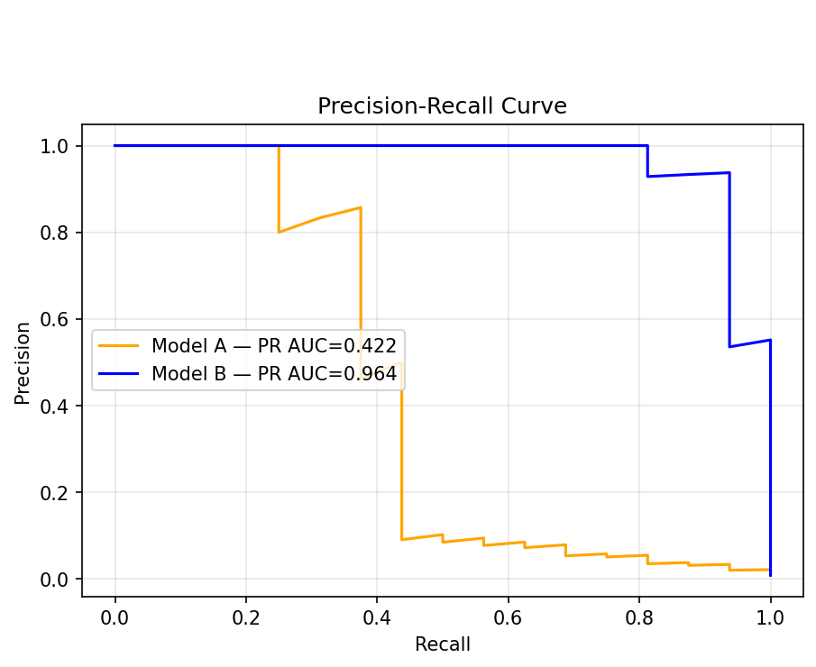
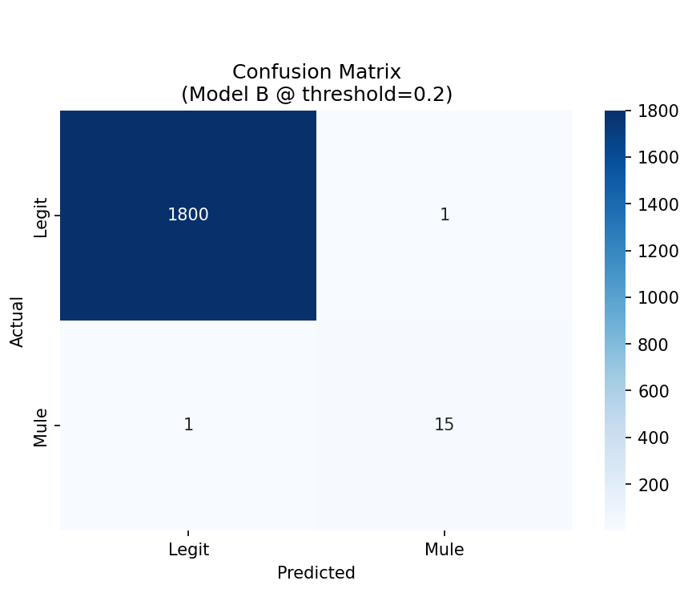
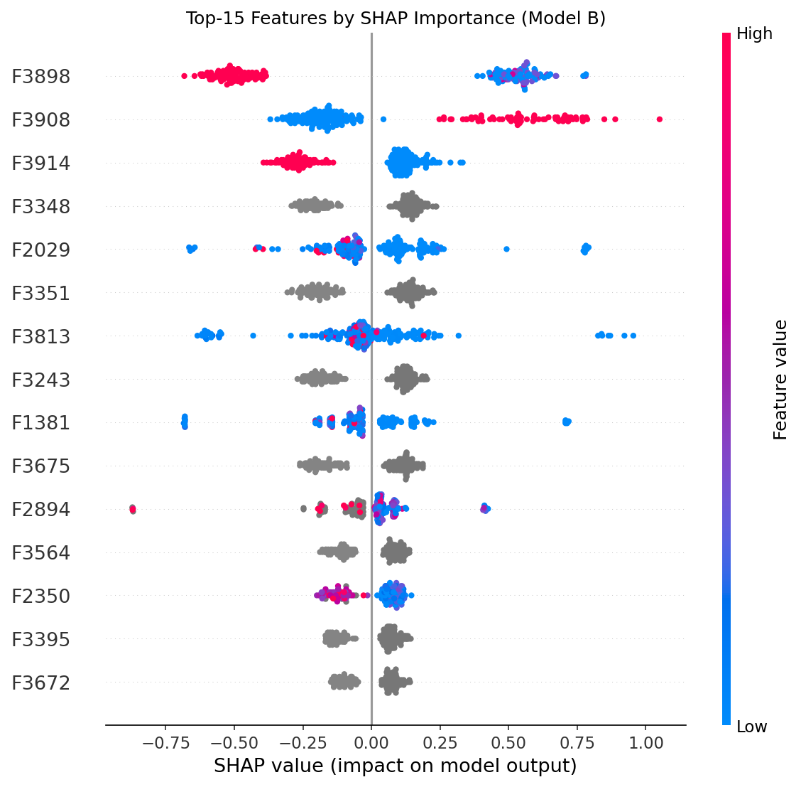
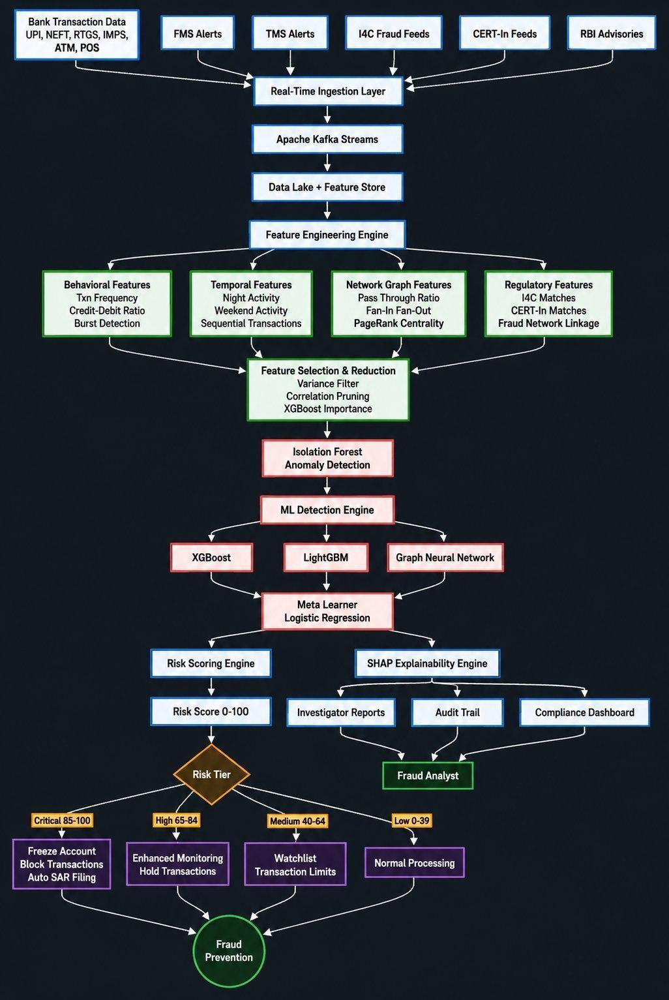

# MuleShield: AI/ML Detection of Suspicious Transactions & Mule Accounts

**Team Aarohan**  
*Laksh Agrawal • Srishti • Naman Verma*  
*Netaji Subhas University of Technology (NSUT), Delhi*  
*Bank of India (BOI) Hackathon 2026*  

---

## 📋 Executive Summary
Mule accounts are the primary mechanism through which fraudsters layer and conceal illicit funds across banking channels. **MuleShield** is a validated, deployment-ready AI/ML classification system developed for the **Bank of India** that identifies suspicious and mule accounts by learning behavioral and transactional patterns from real financial data.

Trained and evaluated on the actual BOI hackathon dataset of **9,082 accounts**, our full-feature **LightGBM model (Model B)** achieved:
*   **PR AUC (Average Precision):** `0.964`
*   **ROC AUC:** `0.9995`
*   **Precision & Recall:** `94%` / `94%` (F1-score: `0.938`)
*   **False Positives:** Only `1` false positive and `1` missed mule out of `1,817` validation accounts.
*   **Leakage Elimination:** Detected and removed `782` leaky database columns to guarantee real-world generalization.

---

## 📂 Project Structure
The project has been structured as follows:

```
MuleShield/
├── README.md                 # Project documentation & report
├── requirements.txt           # Python dependencies
├── MuleShield.ipynb          # Jupyter notebook with data pipeline and model code
│
├── docs/
│   └── MuleShield_Team_Aarohan.pdf   # Hackathon presentation deck
│
├── images/
│   ├── architecture.png      # End-to-end system architecture & decision flow
│   ├── pr_curve.png          # Precision-Recall curves (Model A vs. Model B)
│   ├── confusion_matrix.png  # Confusion matrix for Model B (LightGBM)
│   └── shap_summary.png      # SHAP explanation plot (top 15 features)
│
└── results/
    ├── metrics.txt           # Evaluation summary and classification reports
    └── feature_importance.csv # Ranked list of split-based feature importances
```

---

## 🔍 Critical Discovery: Target Leakage
During initial model runs, artificially inflated validation scores (near 100% accuracy within seconds) were observed. A systematic scan of all 3,924 feature columns against the target label (`F3924`) revealed **782 leaky features**:
1.  **Numeric Proxy Leakage (780 features):** Columns matched the target label in 90.00% to 99.94% of rows due to data collection artifacts (computed alongside or after the target during database extraction).
2.  **Categorical Temporal Leakage (2 features):** 100% of legitimate accounts were labeled with a specific date category (`Oct25`), while 100% of mule accounts had other date categories (`Sep25`/`Nov25`/`Dec25`). The model would learn purely to split on date, rendering it useless for new data.

> [!WARNING]
> All 782 leaky features were dropped during the preprocessing phase. All reported metrics are **100% leakage-free** and derived from a held-out stratified validation set.

---

## 🛠️ Data Preprocessing Pipeline
The pipeline processes raw records through 6 distinct stages:
1.  **Target Leakage Removal:** 782 columns dropped (numeric proxies and date boundaries).
2.  **Row Index Removal:** Dropped sequential row numbers to prevent positional leakage.
3.  **Empty Feature Filter:** Dropped 63 columns containing 100% missing (`NaN`) values.
4.  **Zero-Variance Filter:** Scanned for constant features (none remained after empty filters).
5.  **Categorical Encoding:** Label-encoded columns `F3890` and `F3893` (all other features were already numeric).
6.  **Stratified Split:** Split 80/20 into Train (7,265 rows, 65 mules) and Validation (1,817 rows, 16 mules) to preserve the exact `0.89%` prevalence.

---

## 🤖 Dual-Model Architecture & Results
MuleShield utilizes a dual-model framework to balance latency and accuracy:

| Metric / Attribute | Model A: XGBoost (Fast Baseline) | Model B: LightGBM (Full Feature Set) |
| :--- | :--- | :--- |
| **Features Used** | 15 bank-defined anchor features | 3,078 clean anonymized features |
| **PR AUC** | `0.422` | `0.964` |
| **ROC AUC** | `0.920` | `0.9995` |
| **Precision** | `6%` (at `threshold=0.5`) | `94%` (at `threshold=0.2`) |
| **Recall** | `69%` (at `threshold=0.5`) | `94%` (at `threshold=0.2`) |
| **False Positives** | `170` / `1,801` | `1` / `1,801` |
| **F1-Score** | `0.11` | `0.938` |
| **Primary Use Case** | Fast pre-filtering (real-time, `<50ms` latency) | Maximum accuracy batch scoring and deep alerting |

### 📊 Validation Curves & Matrix
Below are the visual results demonstrating the separation performance of Model B at the optimal risk score threshold of `0.2`:

#### Precision-Recall Curve


#### Confusion Matrix


---

## 💡 Model Explainability (SHAP)
Using **SHAP (SHapley Additive exPlanations)**, MuleShield ensures every flag is explainable to operators and regulatory bodies (complying with RBI explainability guidelines):



*The top features driving predictions belong to the `F3800`–`F3900` range, representing consolidated customer behavior and transaction pattern aggregations.*

---

## 🚦 Risk Scoring & Automated Tiering
Model B was run across the full dataset of 9,082 accounts, scoring them from `0.0` to `1.0` and categorizing them into four risk tiers:

| Tier | Score Range | Accounts Flagged | Automated Action |
| :--- | :--- | :--- | :--- |
| **CRITICAL** | `85.0 - 100.0` | 76 | Escalate for immediate manual audit; recommend temporary account freezes and SAR filing. |
| **HIGH** | `65.0 - 84.9` | 2 | Activate 2-hour cooling-off transaction holds and enhanced real-time logging. |
| **MEDIUM** | `40.0 - 64.9` | 2 | Reduce daily transaction limits; add account to watch-list. |
| **LOW** | `0.0 - 39.9` | 9,002 | Normal processing; continue background passive monitoring. |

---

## 🏗️ End-to-End System Architecture
MuleShield integrates seamlessly into core banking pipelines:



*   **Ingestion:** Ingests transaction events in real time across UPI, NEFT, IMPS, RTGS, ATM, and POS.
*   **Feast Feature Store:** Updates transaction features online (low-latency lookup) and offline (for model training).
*   **Streaming & ETL:** Uses Apache Kafka / KSQL for real-time aggregation and Apache Spark for heavy batch ETLs.
*   **Dual Classifier Serving:**
    *   **FastAPI / Docker / K8s:** Serving container checks Model A instantly; if risk > threshold, it triggers Model B for final tiering and SHAP summary generation.
*   **Downstream Operations:** Pushes alerts to FMS/TMS dashboard (Grafana + Streamlit) and triggers automated holds or freeze signals back to the Core Banking System.

---

## 🚀 Future Enhancements
1.  **Temporal Validation:** Test generalizability across different seasonal intervals.
2.  **Graph Neural Networks (GNNs):** Map transaction networks using PyTorch Geometric to catch layered mule rings (multi-hop transaction chains).
3.  **Real-time External Feeds:** Directly integrate I4C fraud portals, CERT-In bulletins, and RBI suspect registries.
